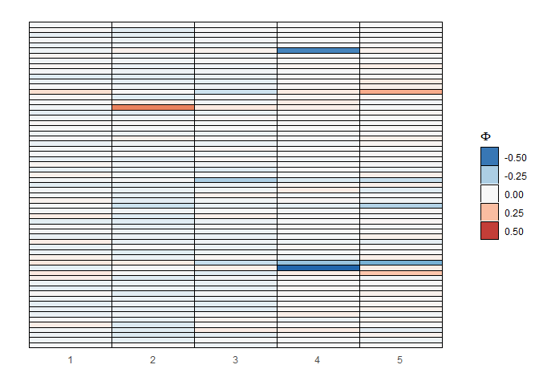

MSFAM Example
================

Source libraries and supporting functions for MSFAM.

``` r
library(mice)
library(ggplot2)
library(latex2exp)
library(dplyr)

source("utils.R")
```

Load in example data set. These are two studies relating gene expression
counts from ovarian cancer tumors. The same cells appear in both
studies.

``` r
dat <- get_incomplete_data(num_cols_incomplete=5, 
                           prop_col_incomplete = 0.2, 
                           missingness_type = "MCAR")  # or "MNAR"
S <- length(dat)  # number of studies

# impute
dat_impute <- list()
for (s in 1:S) {
  dat_impute[[s]] <- 
    complete(mice(dat[[s]], 
                  m=1, 
                  meth="rf", 
                  seed=500, threshold=5)) %>% as.matrix()
}

# get parameters to initialize ECM algorithm
k <- 5  # latent dimensions of common factor loading matrix
j_s <- c(3, 3)  # latent dimensions of study-specific factor loading matrices
start_value <- start_msfa(X_s = dat_impute, 
                          k = k, j_s = j_s, 
                          fa.method='ml')

# run ECM algorithm
res <- ecm_msfam(X_s=dat, start=start_value, nIt=2000)
```

Illustrate results.

``` r
# common factor loading matrix

p <- nrow(res$Phi)
Phi.vec <- c(res$Phi)
Phi.dat <- data.frame(value=Phi.vec,
                      row=rep(1:p, k),
                      col=rep(1:k, each=p))

ggplot(Phi.dat, aes(col, -row, fill=value)) +
  geom_tile(color = "black") +
  # geom_text(aes(label = round(value, 1))) +
  scale_fill_distiller(palette="RdBu", limit=max(abs(Phi.dat$value))*c(-1, 1)) +
  theme_bw() +
  theme(axis.title = element_blank(),
       axis.text.y = element_blank(),
       axis.text.x = element_text(vjust=10),
       panel.border = element_blank(),
       panel.grid.major = element_blank(),
       panel.grid.minor = element_blank(),
       axis.ticks = element_blank()) +
  guides(fill=guide_legend(title=TeX("$\\Phi")))
```

<!-- -->
